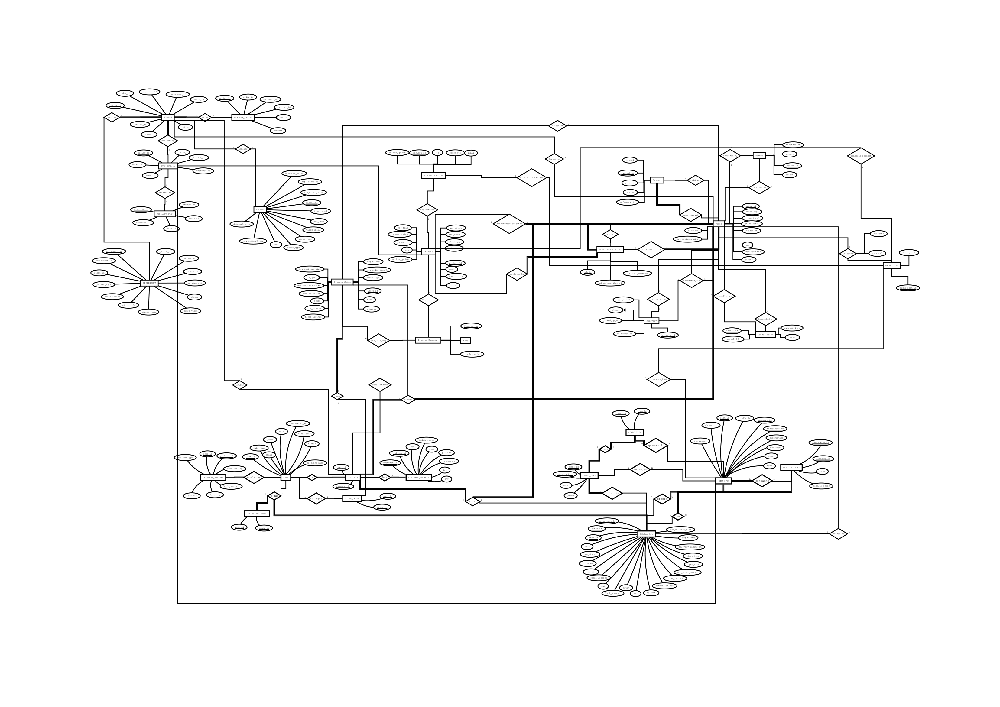
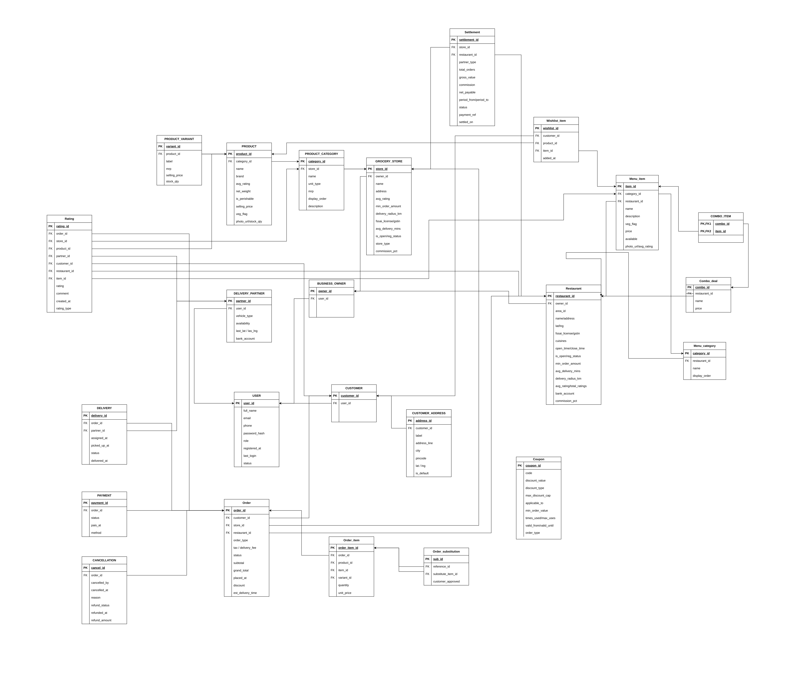

# 🍔 QuickBite - Food Delivery & Grocery Delivery Database Management System


A comprehensive **Database Management System (DBMS)** project for an online **Food Delivery & Grocery Delivery Platform**, inspired by applications like **Swiggy**, **Zomato**, **Blinkit**, and **Instamart**.

The project models the complete workflow of an online delivery platform—from customer registration to restaurant/store management, order placement, payment processing, delivery tracking, ratings, reviews, coupons, settlements, and analytics.

---

# 📖 Table of Contents

- Project Overview
- Features
- System Modules
- Database Design
- Entity Relationship Diagram
- Relational Schema
- Database Structure
- SQL Files
- Sample Queries
- Technologies Used
- Project Structure
- Future Scope
- Contributors
- License

---

# 📌 Project Overview

**QuickBite** is a relational database designed for an online food and grocery delivery platform.

The database supports two independent business models:

- 🍕 Food Delivery
- 🛒 Grocery Delivery

The system handles the complete lifecycle of an order:

Customer Registration

↓

Restaurant / Grocery Browsing

↓

Order Placement

↓

Payment

↓

Delivery Assignment

↓

Delivery Tracking

↓

Ratings & Reviews

↓

Settlement

The project has been developed as part of the **IT214 – Database Management System** course.

---

# ✨ Features

## 👤 User Management

- Customer Registration
- Login Management
- Multiple Delivery Addresses
- Business Owners
- Delivery Partners

---

## 🍴 Restaurant Module

- Restaurant Registration
- Menu Categories
- Menu Items
- Combo Deals
- Restaurant Ratings
- Restaurant Availability

---

## 🛒 Grocery Module

- Grocery Stores
- Product Categories
- Products
- Product Variants
- Inventory Management
- Grocery Ratings

---

## 📦 Order Management

- Food Orders
- Grocery Orders
- Order Items
- Order Status Tracking
- Item Substitution
- Order Cancellation

---

## 💳 Payment Module

- Online Payments
- Cash on Delivery
- Refund Processing
- Payment Status

---

## 🚴 Delivery Module

- Delivery Partners
- Order Assignment
- Pickup Tracking
- Delivery Tracking
- Delivery Ratings

---

## ⭐ Rating & Review System

- Restaurant Ratings
- Grocery Store Ratings
- Product Ratings
- Menu Item Ratings
- Delivery Partner Ratings

---

## 🎁 Additional Features

- Coupons
- Wishlist
- Settlements
- Combo Offers
- Reports & Analytics

---

# 🗄 Database Design

The project contains a normalized relational database consisting of approximately **24+ tables**, including:

| Module | Tables |
|---------|--------|
| User Management | USER, CUSTOMER, CUSTOMER_ADDRESS |
| Business Owners | BUSINESS_OWNER |
| Grocery | GROCERY_STORE, PRODUCT_CATEGORY, PRODUCT, PRODUCT_VARIANT |
| Restaurant | RESTAURANT, MENU_CATEGORY, MENU_ITEM, COMBO_DEAL, COMBO_ITEM |
| Orders | ORDER, ORDER_ITEM, ORDER_SUBSTITUTION |
| Delivery | DELIVERY_PARTNER, DELIVERY |
| Payment | PAYMENT |
| Cancellation | CANCELLATION |
| Reviews | RATING |
| Coupons | COUPON |
| Wishlist | WISHLIST_ITEM |
| Settlement | SETTLEMENT |

---

## 📊 Entity Relationship Diagram



---

## 🧩 Relational Schema



---

# 📂 SQL Files

```
sql/
│
├── 01_CreateTables.sql
├── 02_InsertData.sql
├── 03_Queries.sql
```

### 1. Create Tables

Contains all table creation statements with:

- Primary Keys
- Foreign Keys
- Constraints

---

### 2. Insert Data

Contains realistic sample data including:

- Users
- Restaurants
- Grocery Stores
- Products
- Orders
- Ratings
- Payments
- Delivery Partners

---

### 3. Queries

Contains **60+ SQL queries** covering:

- CRUD Operations
- Joins
- Aggregations
- Nested Queries
- Correlated Queries
- Group By
- Having
- Ordering
- Reports

---

# 🔍 Sample SQL Queries

### List all Restaurants

```sql
SELECT *
FROM RESTAURANT;
```

---

### Top Rated Restaurants

```sql
SELECT restaurant_id,
       name,
       avg_rating
FROM RESTAURANT
ORDER BY avg_rating DESC
LIMIT 5;
```

---

### Daily Revenue

```sql
SELECT DATE(placed_at),
       SUM(grand_total)
FROM `ORDER`
GROUP BY DATE(placed_at);
```

---

### Top Customers

```sql
SELECT U.full_name,
       SUM(O.grand_total)
FROM CUSTOMER C
JOIN USER U
ON C.user_id=U.user_id
JOIN `ORDER` O
ON C.customer_id=O.customer_id
GROUP BY U.full_name;
```

---

### Most Ordered Products

```sql
SELECT product_id,
       SUM(quantity)
FROM ORDER_ITEM
GROUP BY product_id;
```

---

# 📈 Project Statistics

| Feature | Count |
|----------|------:|
| Tables | 24+ |
| SQL Queries | 60+ |
| Sample Records | 500+ |
| ER Diagram | 1 |
| Relational Schema | 1 |
| Business Modules | 10+ |

---

# 🛠 Technologies Used

- MySQL
- SQL
- MySQL Workbench
- Draw.io
- Git
- GitHub

---

# 📁 Repository Structure

```
QuickBite-Food-Delivery-DBMS
│
├── README.md
│
├── docs
│   ├── Project_Report.pdf
│   ├── ERD.pdf
│   └── Relational_Schema.pdf
│
├── images
│   ├── ERD.png
│   ├── RelationalSchema.png
│   ├── Query1.png
│   └── Query2.png
│
├── sql
│   ├── 01_CreateTables.sql
│   ├── 02_InsertData.sql
│   └── 03_Queries.sql
│
└── LICENSE
```

---

# 🚀 Future Scope

Some possible improvements include:

- Web Application Integration
- REST API Development
- Admin Dashboard
- Customer Dashboard
- Recommendation System
- Real-time Order Tracking
- Location-based Restaurant Search
- Machine Learning-based Food Recommendation
- Mobile Application Integration

---

# 🎓 Learning Outcomes

This project demonstrates practical implementation of:

- Entity Relationship Modeling
- Relational Database Design
- Database Normalization
- SQL Programming
- Complex Joins
- Aggregate Functions
- Nested Queries
- Foreign Key Relationships
- Transaction Modeling
- Real-world Database Design

---

# 👥 Contributors

- **Lakshya Sutariya**
- **Rudra Trivedi**


---

# 🙏 Acknowledgements

- Dhirubhai Ambani University
- IT214 – Database Management System Course
- PM Jat
- Swiggy
- Zomato
- Blinkit
- Instamart

---

# 📜 License

This project is intended for **educational purposes only**.

You are free to fork and use it for learning.

---

## ⭐ If you found this project helpful, don't forget to star the repository!
